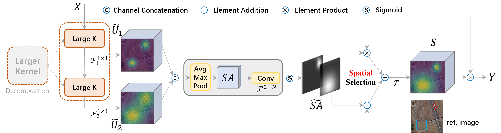

## Introduction


## Results and models

Imagenet 300-epoch pre-trained LSKNet-T backbone: [Download](https://download.openmmlab.com/mmrotate/v1.0/lsknet/backbones/lsk_t_backbone-2ef8a593.pth)

Imagenet 300-epoch pre-trained LSKNet-S backbone: [Download](https://download.openmmlab.com/mmrotate/v1.0/lsknet/backbones/lsk_s_backbone-e9d2e551.pth)

DOTA1.0

|                           Model                            |  mAP  | Angle | lr schd | Batch Size |                                   Configs                                    |                                                               Download                                                               |     note     |
| :--------------------------------------------------------: | :---: | :---: | :-----: | :--------: | :--------------------------------------------------------------------------: | :----------------------------------------------------------------------------------------------------------------------------------: | :----------: |
| [RTMDet-l](https://arxiv.org/abs/2212.07784) (1024,1024,-) | 81.33 |   -   | 3x-ema  |     8      |                                      -                                       |                                                                  -                                                                   |  Prev. Best  |
|                  LSKNet_T (1024,1024,200) + ORCNN          | 81.37 | le90  |   1x    |    2\*8    |     [lsk_t_fpn_1x_dota_le90](./configs/lsknet/lsk_t_fpn_1x_dota_le90.py)     | [model](https://download.openmmlab.com/mmrotate/v1.0/lsknet/lsk_t_fpn_1x_dota_le90/lsk_t_fpn_1x_dota_le90_20230206-3ccee254.pth) \| [log](https://download.openmmlab.com/mmrotate/v1.0/lsknet/lsk_t_fpn_1x_dota_le90/lsk_t_fpn_1x_dota_le90_20230206.log) |              |
|                  LSKNet_S (1024,1024,200) + ORCNN          | 81.64 | le90  |   1x    |    1\*8    |   [lsk_s_fpn_1x_dota_le90](./configs/lsknet/lsk_s_fpn_1x_dota_le90.py)       | [model](https://download.openmmlab.com/mmrotate/v1.0/lsknet/lsk_s_fpn_1x_dota_le90/lsk_s_fpn_1x_dota_le90_20230116-99749191.pth) \| [log](https://download.openmmlab.com/mmrotate/v1.0/lsknet/lsk_s_fpn_1x_dota_le90/lsk_s_fpn_1x_dota_le90_20230116.log) |              |
|                 LSKNet_S\* (1024,1024,200) + ORCNN         | 81.85 | le90  |   1x    |    1\*8    | [lsk_s_ema_fpn_1x_dota_le90](./configs/lsknet/lsk_s_ema_fpn_1x_dota_le90.py) | [model](https://download.openmmlab.com/mmrotate/v1.0/lsknet/lsk_s_ema_fpn_1x_dota_le90/lsk_s_ema_fpn_1x_dota_le90_20230212-30ed4041.pth) \| [log](https://download.openmmlab.com/mmrotate/v1.0/lsknet/lsk_s_ema_fpn_1x_dota_le90/lsk_s_ema_fpn_1x_dota_le90_20230212.log) | EMA Finetune |
|                  LSKNet_S (1024,1024,200) + Roi_Trans      | 81.22 | le90  |   1x    |    2\*8    |   [lsk_s_roitrans_fpn_1x_dota](./configs/lsknet/lsk_s_roitrans_fpn_1x_dota.py)   | [model](https://pan.baidu.com/s/1OhK5juH__L9CeVKQoHFkDQ?pwd=lsks) \| [log](https://pan.baidu.com/s/1MQj0N9qcfPPWiZRlZ2Ad7A?pwd=lsks) |              |
|                  LSKNet_S (1024,1024,200) + R3Det          | 80.08 | oc    |   1x    |    2\*8    |   [lsk_s_r3det_fpn_1x_dota](./configs/lsknet/lsk_s_r3det_fpn_1x_dota.py)   | [model](https://pan.baidu.com/s/186A8Q_j4lNxCp3JcEWy2Bw?pwd=lsks) \| [log](https://pan.baidu.com/s/1xN1GOg1qV7pqhlgUCk0FTQ?pwd=lsks) |              |
|                  LSKNet_S (1024,1024,200) + S2ANet         | 81.32 | le135 |   1x    |    2\*8    |   [lsk_s_s2anet_fpn_1x_dota](./configs/lsknet/lsk_s_s2anet_fpn_1x_dota.py)   | [model](https://pan.baidu.com/s/1bQ41PBzK-OUQX_FYKDO32A?pwd=lsks) \| [log](https://pan.baidu.com/s/1Q4MtKVkyxmFrjW5SMEbTPQ?pwd=lsks) |              |

FAIR1M-1.0

|         Model         |  mAP  | Angle | lr schd | Batch Size |                                                    Configs                                                     |                                                                                                                                                                              Download     | note                                                                                                                                                                         |
| :----------------------: | :---: | :---: | :-----: | :------: | :------------------------------------------------------------------------------------------------------------: | :----------------------------------------------------------------------------------------------------------------------------------------------------------------------------------------------------------------------------------------------------------------------------------------------------------------------------------------------------------------: | :--------: |
| [O-RCNN](https://arxiv.org/abs/2108.05699) (1024,1024,200) | 45.60 | le90  |   1x    |    1*8     |  [oriented_rcnn_r50_fpn_1x_fair_le90](./configs/oriented_rcnn/oriented_rcnn_r50_fpn_1x_fair_le90.py)  |      -   | Prev. Best |
| LSKNet_S (1024,1024,200) | 47.87 | le90  |   1x    |    1*8     |            [lsk_s_fpn_1x_dota_le90](./configs/lsknet/lsk_s_fpn_1x_dota_le90.py)             |         [model](https://pan.baidu.com/s/1sXyi23PhVwpuMRRdwsIJlQ?pwd=izs8) \| [log](https://pan.baidu.com/s/1idHq3--oyaWK3GWYqd8brQ?pwd=zznm)         | |

HRSC2016 

|                    Model                     | mAP(07) | mAP(12) | Angle | lr schd | Batch Size |                                      Configs                                      |                                                               Download                                                               |    note    |
| :------------------------------------------: | :-----: | :-----: | :---: | :-----: | :--------: | :-------------------------------------------------------------------------------: | :----------------------------------------------------------------------------------------------------------------------------------: | :--------: |
| [RTMDet-l](https://arxiv.org/abs/2212.07784) |  90.60  |  97.10  | le90  |   3x    |     -      |                                         -                                         |                                                                  -                                                                   | Prev. Best |
|  [ReDet](https://arxiv.org/abs/2103.07733)   |  90.46  |  97.63  | le90  |   3x    |    2\*4    | [redet_re50_refpn_3x_hrsc_le90](./configs/redet/redet_re50_refpn_3x_hrsc_le90.py) |                                                                  -                                                                   | Prev. Best |
|                   LSKNet_S                   |  90.65  |  98.46  | le90  |   3x    |    1\*8    |       [lsk_s_fpn_3x_hrsc_le90](./configs/lsknet/lsk_s_fpn_3x_hrsc_le90.py)        | [model](https://download.openmmlab.com/mmrotate/v1.0/lsknet/lsk_s_fpn_3x_hrsc_le90/lsk_s_fpn_3x_hrsc_le90_20230205-4a4a39ce.pth) \| [log](https://download.openmmlab.com/mmrotate/v1.0/lsknet/lsk_s_fpn_3x_hrsc_le90/lsk_s_fpn_3x_hrsc_le90_20230205-4a4a39ce.pth) |            |

## Installation

MMRotate depends on [PyTorch](https://pytorch.org/), [MMCV](https://github.com/open-mmlab/mmcv) and [MMDetection](https://github.com/open-mmlab/mmdetection).
Below are quick steps for installation.
Please refer to [Install Guide](https://mmrotate.readthedocs.io/en/latest/install.html) for more detailed instruction.

- Download Anaconda dan Install
```shell
<!-- Download Anaconda -->
curl -O https://repo.anaconda.com/archive/Anaconda3-2024.10-1-Linux-x86_64.sh

<!-- Install Anaconda -->
bash Anaconda3-2024.10-1-Linux-x86_64.sh -b 

<!-- Reload terminal -->
source ~/anaconda3/bin/activate
source ~/.bashrc
```

- Install MMRotate
```shell
<!-- Create Conda Env -->
conda create --name openmmlab python=3.8 -y
conda activate openmmlab
conda install pytorch==1.8.0 torchvision==0.9.0 cudatoolkit=10.2 -c pytorch

<!-- Instal MM -->
pip install -U openmim
mim install mmcv-full
mim install mmdet

<!-- Clone LSKNet Repository -->
git clone https://github.com/zcablii/Large-Selective-Kernel-Network.git
cd Large-Selective-Kernel-Network
pip install -v -e .

<!-- Update Ubuntu dan Install unzip -->
apt update
apt install unzip -y
```

- Menghubungkan Conda Env Dengan Kernel
```shell
conda install ipykernel
pip install timm roboflow jupyter future tensorboard gdown
python -m ipykernel install --user --name=openmmlab --display-name "openmmlab" 
```

- Jalankan jupyter
```shell
jupyter notebook
```

- Catatan:
```shell
Jika hanya menggunakan single GPU maka ubah SyncBN menjadi BN di config yang akan digunakan! 

Contoh-> norm_cfg=dict(type='SyncBN', requires_grad=True)) menjadi Ubah norm_cfg=dict(type='BN', requires_grad=True)) di configs/lsknet/lsk_s_ema_fpn_1x_dota_le90.py


Jika menjalankan jupyter di server non-local jalankan dengan perintah berikut:
jupyter notebook --ip=0.0.0.0 --port=8889 --no-browser --allow-root
```

## Get Started

Please see [get_started.md](docs/en/get_started.md) for the basic usage of MMRotate.
We provide [colab tutorial](demo/MMRotate_Tutorial.ipynb), and other tutorials for:

- [learn the basics](docs/en/intro.md)
- [learn the config](docs/en/tutorials/customize_config.md)
- [customize dataset](docs/en/tutorials/customize_dataset.md)
- [customize model](docs/en/tutorials/customize_models.md)
- [useful tools](docs/en/tutorials/useful_tools.md)